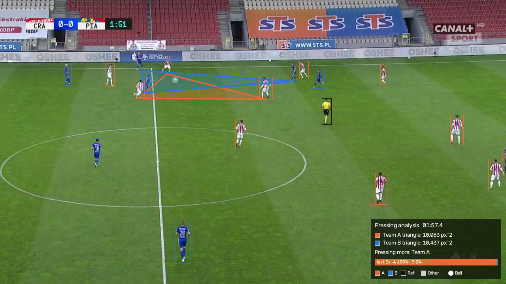
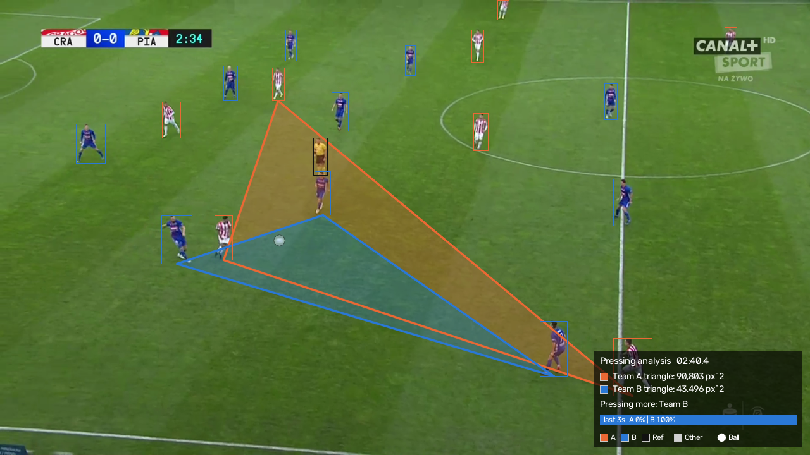
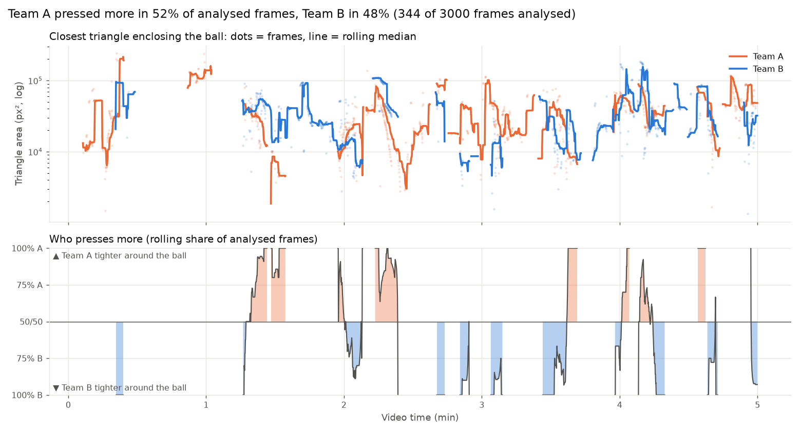
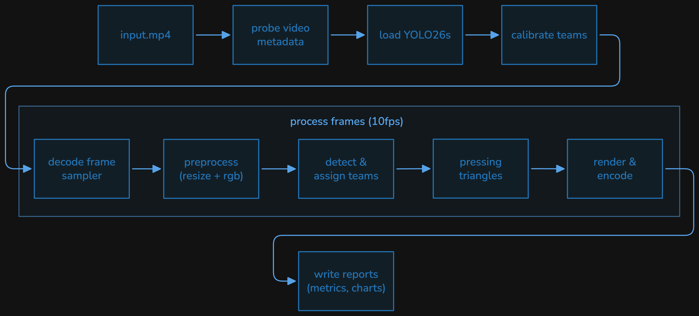

# SkillCorner Assingnment

This project takes a video input and:

1. decodes it and samples frames at 10fps
2. resizes every frame to 720 × 1280 and guarantees 3-channel RGB
3. runs YOLO26s to detect people and the ball
4. splits the people into Team A, Team B, referees and others, using jersey colours
5. for each team, finds the closest triangle of players that encloses the ball and compares the two areas to estimate which team is pressing more
6. writes an annotated `output.mp4`, sample images, charts, metrics, and a log file.

| Annotated frame example 1 | Annotated frame example 2 |
|---|---|
|  |  |



## Quick start

```bash
uv sync                                     # create .venv from uv.lock
uv run main.py cut.mp4                      # full run
uv run main.py cut.mp4 --max-seconds 20     # quick smoke test on the first 20 s
```

CLI options: 

- `--config` (default `config.yaml`)
- `--max-seconds` (process only the start of the video)
- `--output-root` (where run folders are created)


The YOLO26s weights (`models/yolo26s.pt`) come from the official Ultralytics release and are downloaded automatically on the first run. Their SHA-256 is written to the log and to `metrics.json`.

## Outputs

Each run writes into its own timestamped folder, so runs never overwrite each other and can be
compared:

```
outputs/YYYYMMDD-HHMMSS/
├── output.mp4                          # annotated inference result for every sampled frame (10 FPS)
├── pipeline.log                        # full log: metadata, timing every 10 frames, totals
├── metrics.json                        # machine-readable run summary (timing, detection, pressing, env, model hash)
├── config.yaml                         # resolved configuration used 
└── visualizations/
    ├── sample_1.png … sample_n.png     # annotated frames
    ├── pressing_timeline.png           # triangle areas and pressing share over time
    └── latency.png                     # ms/frame over time and per stage
```

What the annotated frames show:

- **Boxes**: orange = Team A, blue = Team B, black = referee, light grey = other (goalkeepers,
  others).
- **Translucent white disc**: the detected ball.
- **Thick box with a marker above it**: the ball carrier.
- **Filled triangles**: each team's closest triangle enclosing the ball.
- **Panel (bottom right)**: time, both triangle areas, this frame's verdict, and a bar with the share of the last 3 s won by each team.

## Pipeline architecture



Each box is a plain function or small class with explicit inputs and outputs, in its own module:

| Module | Responsibility |
|---|---|
| `config.py` | Typed configuration (pydantic) |
| `video.py` | Metadata probing, timestamp-based 10 FPS sampling |
| `preprocess.py` | Resize, RGB conversion and validation |
| `detection.py` | YOLO wrapper |
| `teams.py` | Team/referee/other assignment |
| `pressing.py` | Possession triangles geometry |
| `visualize.py` | Frame annotation and summary charts |
| `logging_utils.py` | Logging setup |
| `pipeline.py` | Orchestration of the steps |
| `cli.py` / `main.py` | Command-line entry point |
